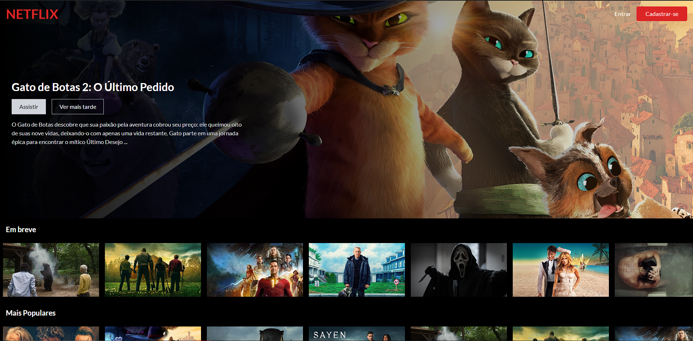
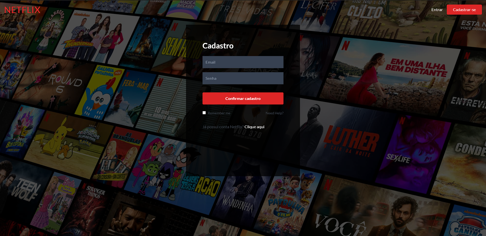
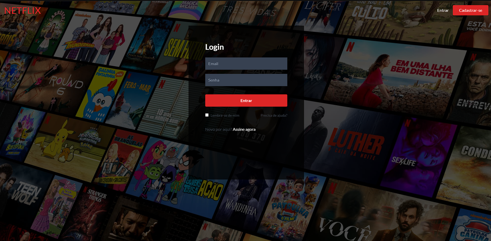
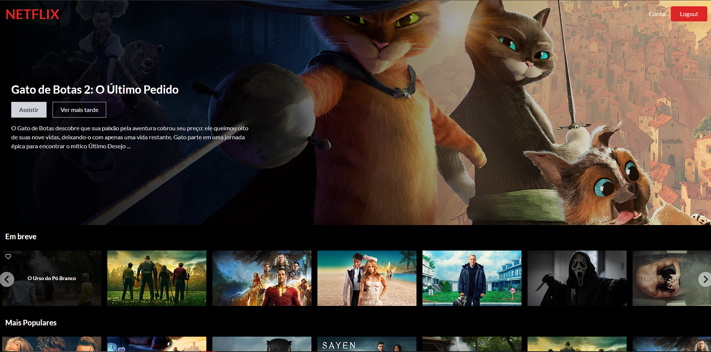
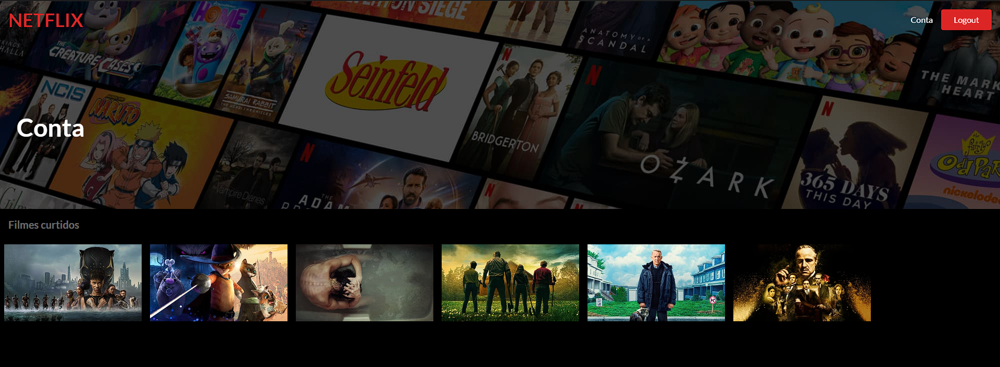

<h1 align="center">
    

</h1>


## 💻 Sobre o projeto

Project-netflix é um projeto reacriando o site da Netflix, copiando algumas de suas funcionalidades. 

Acesse  o deploy: https://netflix-project-87ca7.web.app/

---

## ⚙️ Funcionalidades

- [x] Página home:
  - Carrega novos filmes 
  - Usúario tem acesso ao link que leva a tela de cadastro
  - Usúario tem acesso ao link que leva a tela de login
- [x] Página Cadastro:
  - Cria novo úsuario 
  - Informa se há algum erro: email repetido ou senha fraca
- [x] Página Login:
  - Loga o úsuario que há o cadastro no banco de dados
  - Informa se há algum erro de senha ou email inválidos
- [x] Página De logado:
   - O úsuario pode passar o mouse pelos card dos filmes e clicar no like (ícone de coração) para adicionar aos favoritos
  -  O úsuario pode ir para página Conta
  -  O úsuario pode fazer loggout da conta
- [x] Página de Conta:
  -  Usúario tem acesso a lista de filmes favoritos 
  -  Usúario pode excluir filmes da lista de filmes favoritos 
  -  O úsuario pode fazer loggout da cont
  

---

## 🎨 Layout

O layout da aplicação:

<h1 align="center">
    
    
    
    
    

</h1>

# 🚀 Pré-requisitos

Antes de começar, você vai precisar ter instalado em sua máquina as seguintes ferramentas:
[Git](https://git-scm.com), [Node.js](https://nodejs.org/en/). 
Além disto é bom ter um editor para trabalhar com o código como [VSCode](https://code.visualstudio.com/)


## 🧭 Rodando a aplicação web (Frontend)

```bash

# Clone este repositório
$ git clone https://github.com/rodrigoMedeiros0/netflix-project-ReactAndFirebase.git

# Acesse a pasta do projeto no seu terminal/cmd
$ cd netflix-project

# Instale as dependências
$ npm install

# Execute a aplicação em modo de desenvolvimento
$ npm run start

# A aplicação será aberta na porta:3000 - acesse http://localhost:3000

```

---

## 🛠 Tecnologias

As seguintes ferramentas foram usadas na construção do projeto:

#### **Website**  ([React](https://reactjs.org/)  +  [Tailwind](https://tailwindcss.com))

-   **[React Router Dom](https://github.com/ReactTraining/react-router/tree/master/packages/react-router-dom)**
-   **[React Icons](https://react-icons.github.io/react-icons/)**
-   **[Axios](https://github.com/axios/axios)**
-   **[useState](https://legacy.reactjs.org/docs/hooks-reference.html#usestate)**
-   **[useEffect](https://legacy.reactjs.org/docs/hooks-reference.html#useeffect)**
-   **[useContext](https://legacy.reactjs.org/docs/hooks-reference.html#usecontext)**


#### **Server**  ([Firebase](https://firebase.google.com/?hl=pt-br)) 

-   **[Authentication](https://firebase.google.com/docs/auth?hl=pt-br)**
-   **[Database](https://firebase.google.com/docs/database/web/start?hl=pt-br)**
-   **[Hosting](https://firebase.google.com/docs/hosting?hl=pt-br)**


> Veja o arquivo  [package.json](https://github.com/rodrigoMedeiros0/netflix-project-ReactAndFirebase/blob/main/package.json)

---

## 💪 Como contribuir para o projeto

1. Faça um **fork** do projeto.
2. Crie uma nova branch com as suas alterações: `git checkout -b my-feature`
3. Salve as alterações e crie uma mensagem de commit contando o que você fez: `git commit -m "feature: My new feature"`
4. Envie as suas alterações: `git push origin my-feature`
> Caso tenha alguma dúvida confira este [guia de como contribuir no GitHub](./CONTRIBUTING.md)

---

## 📝 Licença

Este projeto esta sobe a licença.

Feito com ❤️ por Rodrigo Medeiros 👋🏽 [Entre em contato!](https://www.linkedin.com/in/rodrigo--medeiros/)
